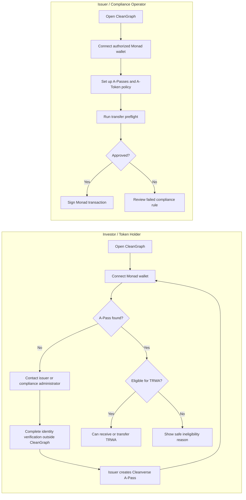

# CleanGraph Product Requirements Document

**Status:** Implementation-aligned v0.3
**Track:** Track 1 — Real-World Assets (RWA)  
**Technical source:** Cleanverse Cooperate API v5.6, July 21, 2026  
**Last updated:** July 31, 2026

## 1. Product Summary

CleanGraph is a compliance orchestration application for issuing and
transferring tokenized real-world assets on Monad. It combines Cleanverse
A-Pass identity records, A-Token asset rules, pre-transfer eligibility checks,
on-chain settlement, and downloadable transaction evidence in one operator
workflow.

For the MVP, the A-Token represents a demo beneficial interest in a fictional
portfolio of short-term United States Treasury bills. It does not create a
real security, ownership claim, or right to actual Treasury assets.

The hackathon demonstration will show the same RWA transfer attempted with two
different counterparties:

1. An eligible wallet passes the A-Token policy and completes the transfer.
2. An ineligible wallet fails preflight and is stopped before signing or
   spending gas.

## 2. Problem

RWA issuers need to restrict asset circulation to eligible counterparties while
retaining an understandable audit trail. Raw blockchain transfers do not give
an operator a clear view of identity eligibility, asset rules, denial reasons,
and supporting reports in one place.

Cleanverse supplies the identity, asset, and compliance primitives. CleanGraph
turns those primitives into a visible, repeatable issuance and transfer
workflow.

## 3. Target Users

### Primary customer and user

The primary customer is a regulated traditional-finance institution that must
keep tokenized-asset activity compliant with applicable law. The primary
application user is an RWA issuer, institutional treasury operator, or
compliance operator who:

- launches or monitors a compliant A-Token;
- reviews its eligibility rules;
- initiates or supervises transfers; and
- downloads transaction evidence.

### Secondary user

An eligible investor or treasury wallet that connects to the application,
reviews a transaction, and signs an approved A-Token transfer.

### Confirmed MVP asset and policy

- Asset description: demo beneficial interest in a fictional portfolio of
  short-term United States Treasury bills
- Token name: `Tokenized Real-World Asset`
- Token symbol: `TRWA`; product copy may display it as `$TRWA`
- Token decimals: `18`
- Demo supply: `1,000,000 TRWA`
- Investor mapping: A-Pass group `Institutional Investor` and subgroup
  `Accredited Investor`; the exact sandbox identifiers must be discovered
  before issuance
- Country policy: allowlist using ISO 3166-1 alpha-2 codes `US`, `GB`, `DE`,
  and `SG`
- Wallet A: active, unexpired A-Pass with the required investor mapping and
  country `GB`
- Wallet B: active, unexpired A-Pass with the same investor mapping and country
  `BR`; it fails only the country rule
- Additional CleanGraph transfer cap: none for the MVP

The country list and accreditation labels are demonstration policy choices.
They must not be presented as legal advice, a sanctions list, or a production
eligibility determination.

## 4. Goals

- Integrate both A-Pass and A-Token in the core RWA flow.
- Demonstrate issuance-stage compliance rules for an A-Token on Monad.
- Verify both transfer counterparties before requesting a wallet signature.
- Make each compliance check and result visible in a live terminal.
- Complete one real A-Token transfer on Monad.
- Block one ineligible transfer before wallet signing.
- Provide a transaction record and downloadable report when supported by the
  Cleanverse sandbox.
- Keep all Cleanverse credentials and encryption operations on the backend.

### 4.1 Current delivery state

The following foundation is implemented and covered by automated tests:

- pnpm monorepo with Vite/React, Hono, shared contracts, and a Node-only
  Cleanverse client;
- secure Cleanverse configuration, AES/CBC request encryption, request
  correlation, timeout handling, envelope parsing, and redacted typed errors;
- A-Pass generation plus A-Pass, A-Token rule, and eligibility reads;
- encrypted A-Token launch, application-status reads, and bounded polling;
- `GET /health`, `GET /ready`, and
  `POST /api/v1/compliance/preflight`;
- sender and recipient verification with ordered, sanitized decision checks;
  and
- the responsive frontend shell, transfer fields, and initial terminal layout.

The MVP is not complete until the team provisions the real sandbox demo state,
connects Monad contracts and wallet signing, wires the frontend to the API,
implements transaction evidence, and verifies both live demo journeys.

## 5. Non-Goals

- Zero-knowledge proof implementation
- Autonomous AI-agent or delegated sub-A-Pass flows
- Production KYC collection
- Legal determination of accreditation or sanctions status
- Fiat ramp integration
- Cross-chain settlement
- A production-grade policy administration system
- Production deployment during the initial implementation phases

## 6. Core User Journeys

### 6.1 Prepare an eligible identity

1. An authorized operator provides a demo customer's identity attributes.
2. The backend submits an encrypted `POST /generate_apass` request for Monad.
3. CleanGraph records the returned Cleanverse record and transaction
   identifiers without exposing sensitive identity data in the browser.
4. The operator confirms the A-Pass is active with `POST /query_apass`.

This setup may be performed before the live presentation to avoid waiting for
on-chain confirmation.

### 6.2 Issue the RWA A-Token

1. The operator enters the RWA token metadata and initial compliance rule.
2. The backend submits encrypted `POST /atoken/launch`.
3. CleanGraph stores the returned `requestId`.
4. CleanGraph polls `GET /atoken/query_apply_status/{requestId}` until a
   terminal status is reached.
5. Only `ISSUED` counts as success.
6. The admin wallet grants `MINTER_ROLE` and the demo supply is minted using
   the Cleanverse-provided contract interface.

The A-Token should be issued before the main transfer demonstration because the
Cleanverse application flow is asynchronous.

### 6.3 Complete an eligible transfer

1. The user connects a wallet.
2. The user selects the RWA A-Token, recipient, and amount.
3. CleanGraph calls `POST /verify_apass` for the sender.
4. CleanGraph calls `POST /verify_apass` for the recipient.
5. CleanGraph loads the displayed A-Token policy from `POST /atoken/rules`.
6. When every check passes, the frontend requests a wallet signature.
7. The A-Token transfer is broadcast to Monad.
8. CleanGraph displays the confirmed transaction hash.
9. CleanGraph queries `POST /query_txs`.
10. CleanGraph requests `POST /download_travel_rule` and displays the
    time-limited report link when available.

### 6.4 Block an ineligible transfer

1. The user selects the ineligible demo wallet or recipient.
2. CleanGraph runs the same preflight sequence.
3. A `verify_apass` result other than `data.code: 4` produces a denial.
4. The terminal shows the failed check and normalized reason.
5. CleanGraph does not request a wallet signature or broadcast a transaction.

### 6.5 MVP wallet-based onboarding

CleanGraph does not use email/password registration in the MVP. Both user
types begin by connecting a Monad-compatible wallet. A wallet address is the
identifier used for A-Pass eligibility and for signing approved transactions.

#### Investor or token-holder flow

1. The investor opens CleanGraph and connects their Monad wallet.
2. CleanGraph checks whether the connected address has an active Cleanverse
   A-Pass and whether it is eligible for the selected A-Token.
3. If eligible, the investor can receive or initiate a `TRWA` transfer and is
   asked to sign only after the full preflight succeeds.
4. If no A-Pass exists, CleanGraph displays a safe instruction to contact the
   issuer or compliance administrator. It does not collect identity documents
   or perform self-service KYC in the MVP.
5. The authorized issuer completes any required identity process outside the
   public CleanGraph interface and creates the A-Pass through Cleanverse. The
   investor reconnects the same wallet after approval.
6. If an A-Pass exists but does not satisfy the A-Token policy, CleanGraph
   displays the safe denial reason and does not request a signature.

#### Issuer or compliance-operator flow

1. The operator opens CleanGraph and connects an authorized Monad wallet.
2. The operator prepares A-Passes and the A-Token policy, then issues or
   manages `TRWA` using protected operator functions.
3. The operator enters a proposed recipient and amount, then runs preflight.
4. When all checks pass, the authorized wallet signs the Monad transaction.
5. When a check fails, the operator reviews the failed rule; no signature or
   blockchain transfer is requested.

For the MVP demo, Wallet A and Wallet B are provisioned in advance by the
operator. There is no public A-Pass registration screen, operator login, or
production KYC/KYB workflow.

## 7. Functional Requirements

### FR-1: Wallet connection

- The frontend must support a Monad-compatible EVM wallet.
- Privy is the preferred candidate, subject to validation.
- The interface must show the connected address and network.
- Transfer actions must be disabled on the wrong network.

### FR-2: Asset issuance visibility

- The product must submit or display an A-Token launch initiated through
  `POST /atoken/launch`.
- It must display the request ID and application state.
- It must distinguish `PENDING`, `APPROVED`, `ISSUING`, `ISSUED`, `REJECTED`,
  and `ISSUE_FAILED`.
- It must treat only `ISSUED` as a usable asset.

### FR-3: Asset rule display

- The product must display tier, sub-tier, group, sub-group, and country rules
  returned by `POST /atoken/rules`.
- It must indicate whether countries are used as an allowlist or denylist.
- It must not describe application-level amount limits as native A-Token rules.

### FR-4: Pre-transfer verification

- The backend must verify sender and recipient separately.
- A Cleanverse request is technically successful only when the top-level
  `code` is `"0000"`.
- An A-Pass is eligible for the A-Token only when `data.code` is `4`.
- `data.code` values `1`, `2`, and `3` must be mapped to clear denial reasons.
- HTTP 200 alone must never be treated as approval.

### FR-5: Transfer amount handling

- CleanGraph must validate that the transfer amount is positive and can be
  represented safely using the A-Token's 18 decimals.
- CleanGraph will not enforce an additional per-transfer, daily, or cumulative
  amount limit in the MVP.
- Product copy must not claim that Cleanverse provides a native amount limit.

### FR-6: Settlement

- Approved transfers must be signed by the connected wallet.
- The frontend must submit the transfer to Monad.
- The UI must show pending, confirmed, and failed transaction states.
- A preflight approval must not be presented as proof of settlement.

### FR-7: Compliance terminal

- The UI must show each check in execution order.
- Each event must have a timestamp, state, readable label, and safe diagnostic
  details.
- The terminal must use distinct pending, approved, denied, and error states.
- Secrets and raw sensitive identity data must never appear in events.

### FR-8: Transaction evidence

- After confirmation, CleanGraph must query the indexed transaction.
- CleanGraph must request a report for supported A-Token transfers.
- The interface must show that report URLs are time-limited.
- A missing or delayed report must not change a confirmed transfer into a
  failed transfer.

### FR-9: Deterministic presentation mode

- If approved by the team, a clearly labelled demo mode may replay sanitized
  fixtures when the sandbox or indexer is unavailable.
- Demo mode must never be presented as a live Cleanverse response.

## 8. Compliance Policy Mapping

| Product concept | Documented Cleanverse representation |
| --- | --- |
| KYC verified | A-Pass exists, is active, unexpired, and passes `verify_apass` |
| Accredited investor | Demo mapping to A-Pass group `Institutional Investor` and subgroup `Accredited Investor`; exact sandbox IDs remain to be confirmed |
| Permitted jurisdiction | Country allowlist `US`, `GB`, `DE`, and `SG`, evaluated using A-Pass country tags |
| Frozen or restricted wallet | A-Pass status and `verify_apass` result |
| Transaction amount limit | Excluded from the MVP; not documented in the A-Token rule object |
| Asset transfer permission | `POST /verify_apass` with `data.code: 4` |
| Audit evidence | `POST /query_txs` and `POST /download_travel_rule` |

The v5.6 guide does not document a standalone OFAC or sanctions-screening
endpoint. Product copy must not claim a direct OFAC API call unless Cleanverse
provides additional documentation.

## 9. User Experience Requirements

- Use a split layout with the transfer form and compliance terminal visible at
  the same time on desktop.
- Keep the main demo path usable on a laptop-sized screen.
- Explain denial reasons in plain language and include the underlying safe code.
- Prevent double submission while preflight or settlement is active.
- Make the successful and denied scenarios selectable without editing code.
- Provide direct links to the Monad explorer and report when available.

## 10. Security and Privacy Requirements

- Store `api-id` and `api-key` only in backend environment variables.
- Never expose the AES key through Vite environment variables.
- Perform AES/CBC/PKCS5-compatible encryption only on the backend according to
  the Cleanverse v5.6 specification.
- Never log plaintext identity documents, bank accounts, API keys, private
  keys, or encrypted request bodies.
- Generate and propagate an `X-Request-ID` for correlation.
- Validate all browser input before calling Cleanverse or Monad.
- Keep blockchain private keys out of the application; user transfers must use
  wallet signatures.

## 11. Reliability Requirements

- Apply timeouts to Cleanverse requests.
- Normalize HTTP errors separately from Cleanverse business-code failures.
- Make preflight requests safe to retry.
- Poll asynchronous issuance with a bounded interval and attempt count.
- Do not repeat A-Token rule mutations until the prior on-chain write confirms.
- Treat report indexing delays as a recoverable post-settlement state.

## 12. MVP Success Criteria

- The `TRWA` A-Token representing the fictional Treasury-bill portfolio reaches
  `ISSUED` on Monad with 18 decimals and a demo supply of `1,000,000 TRWA`.
- The demo shows its documented A-Token rule.
- Wallet A receives `verify_apass` result code `4`.
- An eligible A-Token transfer confirms on Monad.
- Wallet B, using country tag `BR`, is denied by the country allowlist before a
  wallet signature is requested.
- The UI shows a clear, ordered compliance trace for both scenarios.
- The successful transfer displays an indexed transaction and report link when
  the sandbox supports them.
- No secrets appear in the Git repository, browser bundle, logs, or video.

### 12.1 Remaining acceptance path

The remaining work is complete only when all of these checkpoints are proven:

1. External prerequisites are recorded: Issue Member permission, exact A-Pass
   group/subgroup codes, Monad RPC/chain/explorer values, the A-Token ABI, and
   role/mint instructions.
2. Wallet A and Wallet B have verified sandbox A-Passes with the intended
   country difference.
3. `TRWA` reaches `ISSUED`, its rule is verified, `MINTER_ROLE` is granted,
   and the demo supply is minted.
4. The frontend connects a Monad wallet, submits a real preflight request, and
   renders the ordered decision checks.
5. An eligible transfer is signed only after approval and confirms on Monad.
6. The Wallet B scenario is denied before any signature request.
7. The confirmed transaction is queried from Cleanverse and a report link is
   shown when supported, without changing settlement success if indexing is
   delayed.
8. The deployed VPS API and Vercel frontend pass the same two journeys without
   leaking secrets.

## 13. Hackathon Submission Constraints

- Build period: August 8, 00:00 through August 9, 23:59 UTC.
- Submission deadline: August 9, 23:59 UTC.
- A public GitHub repository with commit history during the build window is
  required.
- Submission must include a demo video and one-page project summary.
- A live URL or testnet deployment is recommended.
- Submission is sent to the organizer-provided email address.

## 14. Remaining Product Decisions

1. Should deterministic demo mode be included?
2. What exact information should be emphasized on the report screen?
3. Who owns deployment, demo recording, and final submission?
4. Which Cleanverse sandbox tier/group IDs correspond to the confirmed logical
   investor mapping?
5. Which operator-authentication mechanism should protect asset issuance?
